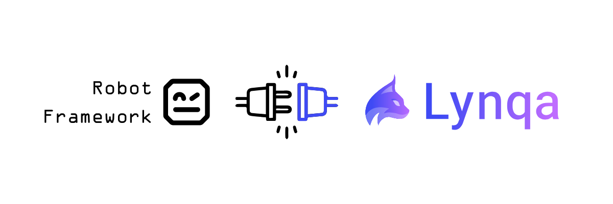

# robotframework-lynqa

[](https://github.com/petit-robot/robotframework-lynqa/actions/workflows/ci.yml)
[](https://github.com/petit-robot/robotframework-lynqa/actions/workflows/acceptance.yml)
[](LICENSE)


**robotframework-lynqa** is a [Robot Framework](https://robotframework.org) library for the
[Lynqa](https://lynqa.smartesting.com) test execution AI Agent.



Write your scenarios in plain Gherkin and have them executed by Lynqa against your web application, instead of by locally
defined keywords. It builds on [pylynqa](https://github.com/petit-robot/pylynqa), the Python client for the Lynqa REST
API.

## Disclaimers

> [!IMPORTANT]
> **This is an unofficial project.** robotframework-lynqa is **not affiliated with, endorsed by, or maintained by
> [Smartesting](https://www.smartesting.com)**, the company that develops Lynqa. "Lynqa" and "Smartesting" are the
> property of their respective owners.

> [!NOTE]
> **Lynqa is a commercial product.** Using this library requires a Lynqa account and an API key, and running tests
> consumes paid credits. See <https://my.lynqa.smartesting.com/integration> to create an API key.

## Requirements

- Python 3.9+
- Robot Framework 7+
- A Lynqa account and API key (test executions consume credits)

## Installation

```bash
pip install robotframework-lynqa
```

> At this early stage the package may not be published on PyPI yet. In the meantime you can install it from source:
>
> ```bash
> pip install git+https://github.com/petit-robot/robotframework-lynqa.git
> ```

## Quick start

Import the library and write your test cases with the `Given`/`When`/`Then` keywords, each taking a single
natural-language step:

```robotframework
*** Settings ***
Library    robotframework_lynqa.LynqaLibrary    api_key=%{LYNQA_API_KEY}

*** Variables ***
${LYNQA_URL}    https://lemonde.fr

*** Test Cases ***
Search An Article
    Given    the website is open
    When     I search an article on "france ia"
    Then     there is an article on "IA agentique"
```

The scenario is captured and submitted to Lynqa, which runs it against the site at `${LYNQA_URL}` and reports each step's
result back to Robot Framework.

### Configuration variables

| Variable            | Required | Description                                                                 |
| ------------------- | -------- |-----------------------------------------------------------------------------|
| `${LYNQA_URL}`      | Yes      | URL of the web application under test.                                      |
| `${LYNQA_LANGUAGE}` | No       | Language of the user running the scenario.                                  |
| `${LYNQA_DATETIME}` | No       | Date and time of the run (defaults to the current local date and time).     |
| `&{LYNQA_SECRETS}`  | No       | Mapping of secret name to value (e.g. `login=superu  password=TrèsS3cr3t`). |

## Collaboration

This project is at an early stage, so **external contributions are limited for now**. This may be opened up more broadly
later as the project matures.

In the meantime, **you are very welcome to open an
[issue](https://github.com/petit-robot/robotframework-lynqa/issues)** to report a bug or ask any question.

## License

Licensed under the [Apache License 2.0](LICENSE).
