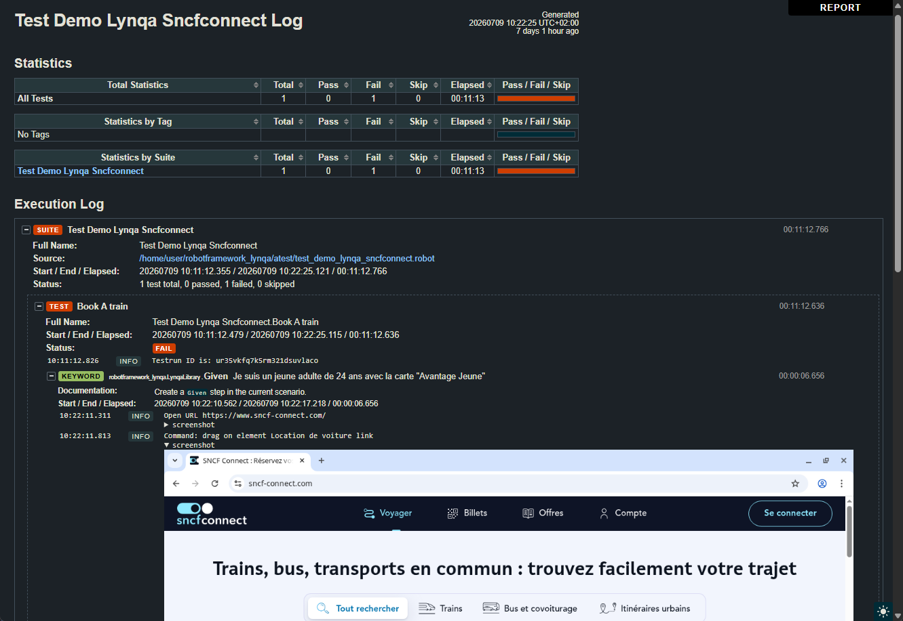

# Getting started

## Installation

```bash
pip install robotframework-lynqa
```

!!! tip "Not on PyPI yet?"

    At this early stage the package may not be published on PyPI yet. In the meantime you can install it from
    source:

    ```bash
    pip install git+https://github.com/petit-robot/robotframework-lynqa.git
    ```

## Your first scenario

Import the library and write your test cases with the `Given`/`When`/`Then` keywords, each taking a single
natural-language step:

```robotframework
*** Settings ***
Library    robotframework_lynqa.LynqaLibrary    api_key=%{LYNQA_API_KEY}

*** Variables ***
${LYNQA_URL}    https://lemonde.fr

*** Test Cases ***
Search An Article
    Given    the website is open
    When     I search an article on "france ia"
    Then     there is an article on "IA agentique"
```

The scenario is captured and submitted to Lynqa, which runs it against the site at `${LYNQA_URL}` and reports
each step's result back to Robot Framework.

## Reading the Robot log

Beyond the pass/fail verdict, the library embeds Lynqa's execution evidence directly in the standard Robot
Framework log (`log.html`). Under each `Given`/`When`/`Then` keyword you get a step-by-step account of what the
agent actually did in the browser:

- **Commands done by the agent**: every low-level action Lynqa performed to carry out the step. A command that failed is 
  logged at `ERROR` level so it  stands out in red.
- **Assertion results**: each check is logged as an `Assertion: "..."` line, at `INFO` level when the
  assertion holds and at `ERROR` level when it fails. When a step fails, the reason reported by Lynqa is logged
  as a `Verdict:` line.
- **Screenshots**: the page state is captured as an inline screenshot at each stage. Screenshots are
  embedded in a collapsible `screenshot` block, so you can expand only the ones you care about.



## Configuration variables

| Variable            | Required | Description                                                                 |
| ------------------- | -------- |-----------------------------------------------------------------------------|
| `${LYNQA_URL}`      | Yes      | URL of the web application under test.                                      |
| `${LYNQA_LOCALE}`   | No       | Browser locale of the user running the scenario, e.g. `fr_FR`.              |
| `${LYNQA_DATETIME}` | No       | Date and time of the run (defaults to the current local date and time).     |
| `&{LYNQA_SECRETS}`  | No       | Mapping of secret name to value (e.g. `login=superu  password=TrèsS3cr3t`). |

## Providing your API key

The library authenticates with the `api_key` argument. Keep the key out of your test data by reading it from an
environment variable with Robot Framework's `%{ENV_VAR}` syntax, as shown above:

```bash
export LYNQA_API_KEY="your-api-key"
robot my_tests.robot
```

Create a key from the [Lynqa integration page](https://my.lynqa.smartesting.com/integration).

## Execution timeout

A Lynqa run is asynchronous: once a scenario is submitted, the library polls Lynqa until the run reaches a final
status. By default it waits up to **1 hour** before failing the test with a timeout error.

To change this behaviour, use Robot Framework's
[timeout feature](https://robotframework.org/robotframework/latest/RobotFrameworkUserGuide.html#timeouts),
the `Test Timeout` setting in `*** Settings ***`, or a `[Timeout]` on an individual test case, which caps how
long a test, including this wait, is allowed to run:

```robotframework
*** Settings ***
Library         robotframework_lynqa.LynqaLibrary    api_key=%{LYNQA_API_KEY}
Test Timeout    30 minutes
```

## Next steps

Head to the [Keyword reference](keywords.md) for the full details of the `Given`/`When`/`Then` keywords and how
they drive Lynqa.
